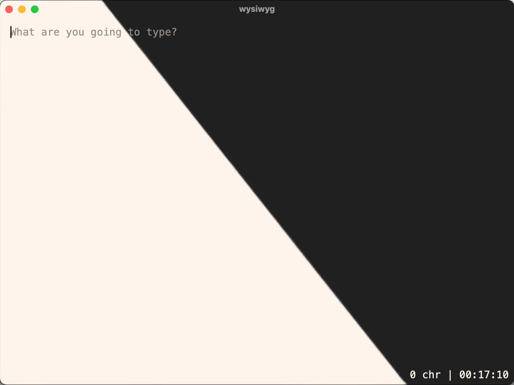
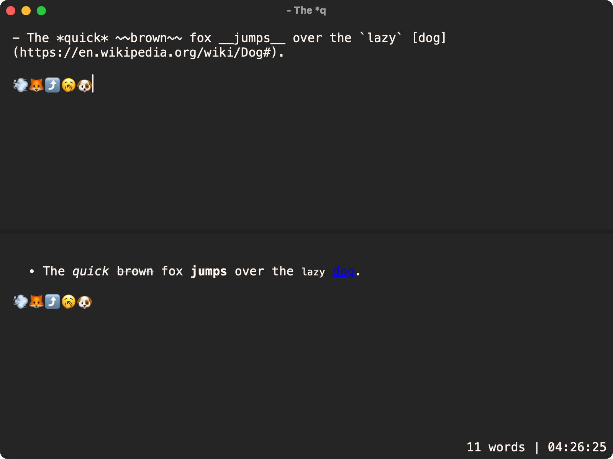

# 
SimpliciText
  

  
  
  
TL;DR:
- Rich text editor with minimalist design
- Super lightweight
- Shortcut based
- Themes support  
  
  

  
Screenshots 👀

  

    
    Light and dark mode!
  

  

    
    Markdown capabilities <i>(and other stats (bottom right))</i>!
  

## SimpliciText?
It can be described as a fully-featured, yet minimal and lightweight text editor (not code editor!).

It's most useful to take quick notes, so think of it as an alternative to TextEdit rather than Notepad++. Better looking, more practical, weight only a few MBs, no reason not to try it!  
  

## Shortcuts
Every shortcut is based on the following combination: `Ctrl + Alt`
Below is the list of every shortcut along with their utility:

  
Ctrl + Alt + T

  
Cycles through the different themes available.

  
Ctrl + Alt + P

  
Pins the window to stay on top of any other application. Toggleable.

  
Ctrl + Alt + ↑ / ↓ / ← / →

  
Split the markdown preview panel in the chosen direction.

  
Ctrl + Alt + M

  
Changes the displayed stats (metrics) on the bottom right.

  
Ctrl + Alt + - / + / =

  
Reduces, increases or resets the text size.

  
Ctrl + Alt + 1 2 3 4 5 6 7 8 9 0

  
Switches tab. Up to 10 tabs can be controlled at the same time, each being a new file.

  
Ctrl + Alt + A

  
Opens the achievements page.

  
Ctrl + Alt + V

  
Activates the vibrancy mode (see through widow with blur).

  
Ctrl + Alt + F

  
Opens a popup to choose between 1600+ fonts.

  
Ctrl + Alt + C

  
Toggles a line counter on the left of every opened panel.

  
Ctrl + Alt + H

  
Opens up a help page to remind you of every shortcuts.

  
Ctrl + Alt + E

  
Cycles through all of the available extension. '.md' > '.html' > '.pdf'

  
Ctrl + Alt + S

  
A manual save. Either in the chosen extension, either in .md.

  
Ctrl + Alt + I

  
Switches to individual saves mode. When in this state, if you change your extension, auto save will be on the file with the other extension, and the manual save will save the file to the .md extension. When you press the shortcut again, everything is the opposite.

  
Ctrl + Alt + R

  
Press R to restart the render.

  
Hold R to restart the app entirely.

  
Escape

  
Hold escape to properly leave the app.

## Themes
Want to contribute? You can make your own theme! Simply take the light or dark theme at `./src/themes/` and adjust the colours as you wish! Then, open an issue / pull request with your theme. If it's good enough, it'll be added so everyone can use it.

Enjoy :)